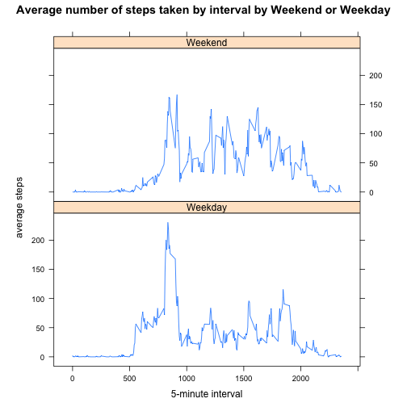

Coursera and Johns Hopkins Bloomberg School of Public Health:
Reproducible Research
Peer Assessment 1
========================================================

#### The purpose of this assignment is to analyse data collected from a personal activity monitor device. The data consists of two months of data from an anonymous individual collected during the months of October and November, 2012 and include the number of steps taken in 5 minute intervals each day.

### Firstly, load and process the data.


```r
fileURL <- "https://github.com/barryne/RepData_PeerAssessment1/blob/master/activity.zip?raw=true"
temp <- tempfile()
download.file(fileURL, temp, method = "curl")
unzip(temp, fileURL)
activitydf <- read.csv("activity.csv")
# Create an alternative version of the activity dataset without observations that include missing values
activityNNA <- na.omit(activitydf)
```

### What is the mean total number of steps taken per day?

```r
library(plyr)
# Make a histogram of the total number of steps taken each day
dailytotal <- ddply(activityNNA, .(date), summarise, sumsteps = sum(steps))
hist(dailytotal$sumsteps, main = "Total Number of Steps per Day", xlab = "steps per day")
```

 

```r
# Calculate and report the mean and median total number of steps taken per day
mean(dailytotal$sumsteps)
```

```
## [1] 10766
```

```r
median(dailytotal$sumsteps)
```

```
## [1] 10765
```
#### The mean total number of steps per day is 10766 and the median is 10765. 

### What is the average daily activity pattern?


```r
# Make a time series plot of the 5-minute interval and the average number of steps taken, averaged across all days
intervalwkavg <- ddply(activityNNA, .(interval), summarise, avgsteps = mean(steps))
plot(intervalwkavg$interval, intervalwkavg$avgsteps, type="l", main = "Average number of steps taken by interval", xlab="5-minute interval", ylab="average steps")
```

 

```r
# Which 5-minute interval, on average across all the days in the dataset, contains the maximum number of steps?
maxstepsint <- max(intervalwkavg$avgsteps)
maxint <- intervalwkavg[intervalwkavg$avgsteps == maxstepsint, 1]
print(maxint)
```

```
## [1] 835
```

#### The 5 minute interval that contains the maximum number of steps is 835


### Imputing missing values


```r
# 1. Calculate and report the total number of missing values in the dataset (i.e. the total number of rows with NAs)
ok <- complete.cases(activitydf)
sum(!ok)
```

```
## [1] 2304
```
#### The total number of missing values in the original dataset is 2304


```r
# 2. The missing values will be filled in using the mean for that 5-minute interval
intervalfill <- function(interval){
    intervalwkavg[intervalwkavg$interval==interval,2]
    }

# 3. Create a new dataset that is equal to the original dataset but with the missing data filled in.
activitycomplt <- activitydf
for(i in 1:nrow(activitycomplt)){
    if(is.na(activitycomplt[i,1])){
        activitycomplt[i,1] <- intervalfill(activitycomplt[i,3])
    }
} 

ok <- complete.cases(activitycomplt)
sum(!ok)
```

```
## [1] 0
```
#### The total number of missing values in the new dataset is 0


```r
# 4. Make a histogram of the total number of steps taken each day and Calculate and report the mean and median total number of steps taken per day. 
dailytotcmplt <- ddply(activitycomplt, .(date), summarise, sumsteps = sum(steps))
hist(dailytotcmplt$sumsteps, main = "Total Number of Steps per Day", xlab = "steps per day")
```

 

```r
mean(dailytotcmplt$sumsteps)
```

```
## [1] 10766
```

```r
median(dailytotcmplt$sumsteps)
```

```
## [1] 10766
```
#### The mean total number of steps per day is 10766 and the median is 10766. 
#### The strategy to fill in the NA values of 'steps' with the mean value for the corresponding 5 minute interval has had no impact on the mean of total number of steps taken per day (since the original mean value was used to fill in the NA values) and negligable impact on the median, increasing it from 10765 to 10766. 


### Are there differences in activity patterns between weekdays and weekends?


```r
# 1. Create a new factor variable in the dataset with two levels – “weekday” and “weekend” 
activitycomplt$date <- as.Date(activitycomplt$date)
activitycomplt$daytype <- as.factor(ifelse(weekdays(activitycomplt$date)%in% c("Saturday", "Sunday"), "Weekend", "Weekday"))

# 2. Make a panel plot containing a time series plot of the 5-minute interval and the average number of steps taken, averaged across all weekday days or weekend days. 
intervalwkavgcmplt <- aggregate(steps~interval+daytype,activitycomplt,mean)
par(mfrow = c(2, 1))
library(lattice)
xyplot(steps~interval|factor(daytype),data=intervalwkavgcmplt,aspect=1/2,type="l", main = "Average number of steps taken by interval by Weekend or Weekday", xlab="5-minute interval", ylab="average steps")
```

 

```r
unlink(temp)
```
#### The weekday and weekend activity pattern does differ. During the morning there are  more steps being taken on weekdays. Both weekday and weekend have their peak in early morning, around 8.30-9am, however the comparison holds with the weekday peak being higher than the weekend peak. The trend is then reversed during weekday business hours, when the activity levels are lower than those of weekend days.
